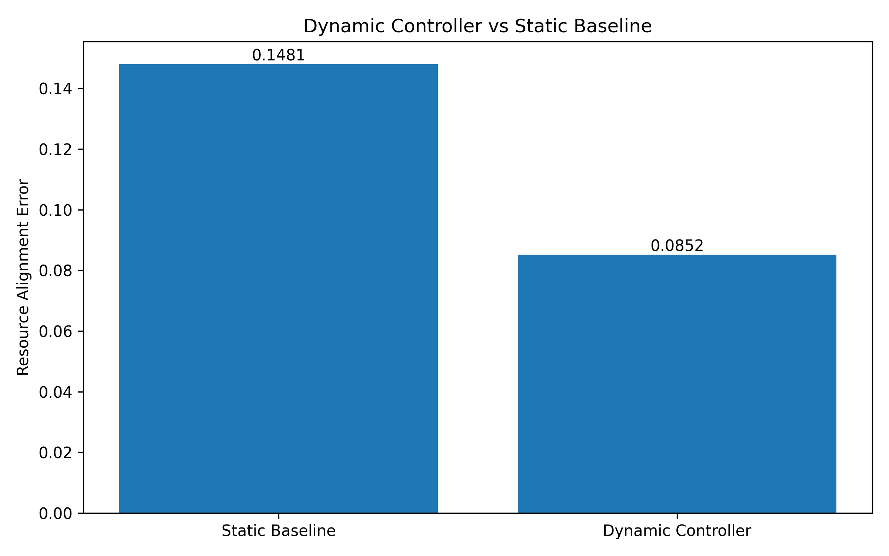
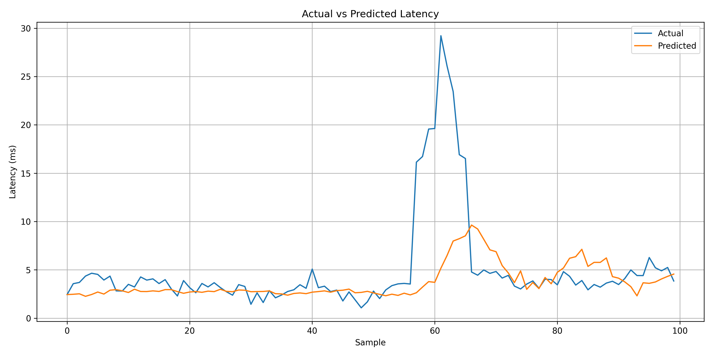
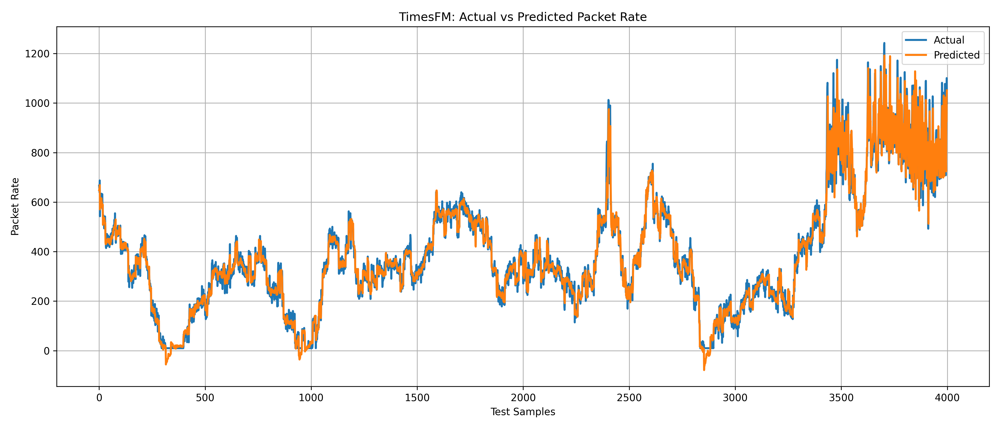
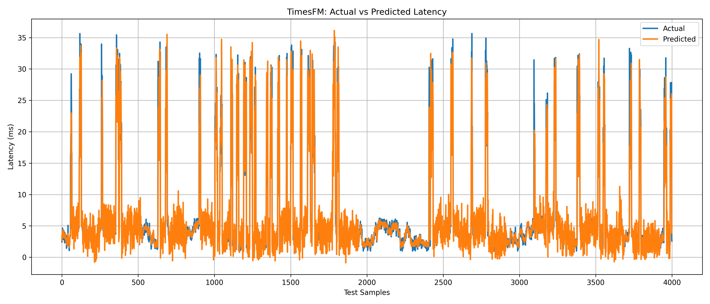
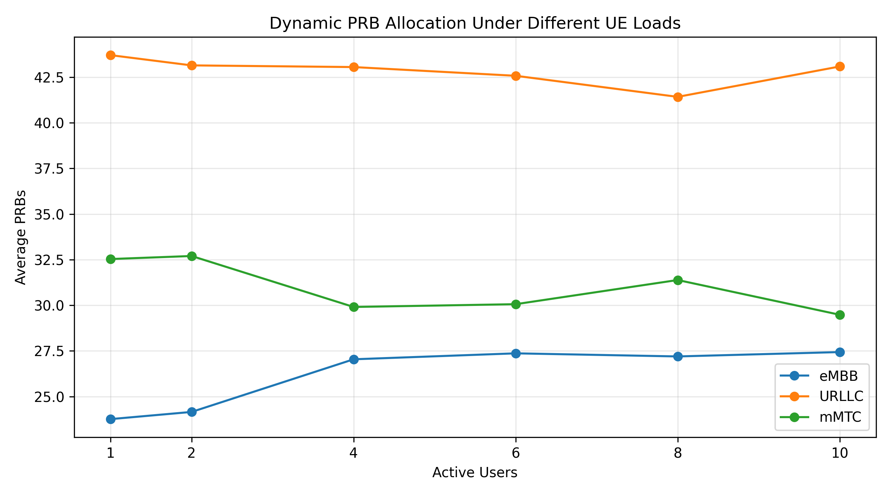
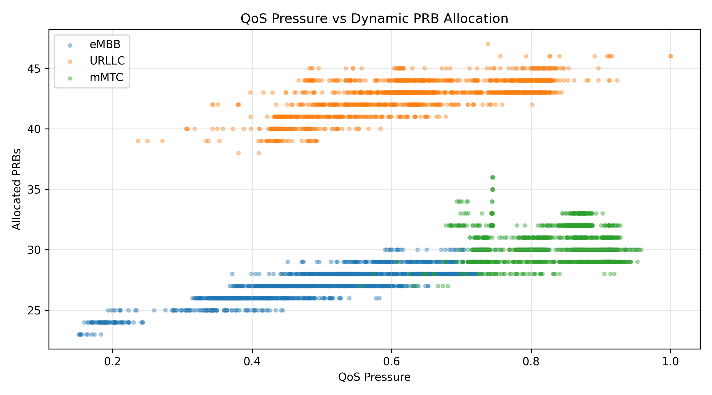

<div align="center">

# 🚀 AI-Driven 5G Network Slicing

<p>
  <strong>Time-Series Forecasting + Dynamic QoS-Aware Resource Allocation</strong>
</p>

<p>
  An end-to-end 5G network slicing framework that uses machine learning<br>
  to forecast network conditions and dynamically allocate network resources.
</p>

</div>

<p align="center">
  
  
  
  
</p>

<p align="center">
  
  
  
</p>

---

## 📌 Project Overview

5G Network Slicing enables a physical 5G infrastructure to be divided into multiple logical networks, or **network slices**, where each slice can be optimized for a different type of application.

This project develops an **AI-driven network slicing framework** that combines a simulated 5G environment with **time-series forecasting** and **dynamic resource allocation**.

The framework focuses on three major 5G service categories:

| Slice | SST | Main Requirement | Forecasting Target | Selected Model |
|:---:|:---:|---|---|:---:|
| 🟦 **eMBB** | 1 | High Throughput | Future Throughput | **LSTM** |
| 🟥 **URLLC** | 3 | Low Latency | Future Latency | **TimesFM** |
| 🟩 **mMTC** | 2 | Massive Connectivity | Future Packet Rate | **PatchTST** |

The core idea is simple:

> **Predict future network conditions → estimate future slice demand → dynamically allocate resources.**

---

# 🎯 Problem Statement

Traditional resource allocation approaches often rely on **static configurations** or current network measurements.

However, 5G traffic conditions continuously change depending on:

- Number of active users
- Traffic intensity
- Throughput
- Latency
- Jitter
- Packet loss
- Packet generation rate

A fixed allocation can therefore lead to:

- Under-utilization of available resources
- Resource contention between slices
- Poor adaptation to changing traffic
- Inefficient QoS management

### 💡 Our Approach

Instead of waiting for network conditions to change, this project attempts to **forecast future network behavior** and use those predictions to make resource allocation decisions.

---

# 🏗️ System Architecture

<p align="center">
  
</p>

### End-to-End Pipeline

                    ┌─────────────────────────┐
                    │      5G TESTBED         │
                    │   Open5GS + UERANSIM    │
                    └────────────┬────────────┘
                                 │
                                 ▼
                    ┌─────────────────────────┐
                    │  Traffic / QoS Data     │
                    │       Collection        │
                    └────────────┬────────────┘
                                 │
                                 ▼
                    ┌─────────────────────────┐
                    │ Dataset Generation &    │
                    │    Preprocessing        │
                    └────────────┬────────────┘
                                 │
                                 ▼
                    ┌─────────────────────────┐
                    │ Time-Series Forecasting │
                    └────────────┬────────────┘
                                 │
              ┌──────────────────┼──────────────────┐
              ▼                  ▼                  ▼
        ┌───────────┐      ┌───────────┐      ┌───────────┐
        │   eMBB    │      │   URLLC   │      │   mMTC    │
        │   LSTM    │      │  TimesFM  │      │  PatchTST │
        └─────┬─────┘      └─────┬─────┘      └─────┬─────┘
              │                  │                  │
              └──────────────────┼──────────────────┘
                                 │
                                 ▼
                    ┌─────────────────────────┐
                    │ Predicted Network       │
                    │ Conditions              │
                    └────────────┬────────────┘
                                 │
                                 ▼
                    ┌─────────────────────────┐
                    │ Demand Estimation       │
                    └────────────┬────────────┘
                                 │
                                 ▼
                    ┌─────────────────────────┐
                    │ QoS-Aware Resource      │
                    │ Controller              │
                    └────────────┬────────────┘
                                 │
                                 ▼
                    ┌─────────────────────────┐
                    │ Dynamic PRB Allocation  │
                    │       100 PRBs          │
                    └─────────────────────────┘

# 📡 5G Network Environment

The networking environment is built using:

### 🔹 Open5GS

Provides the **5G Core Network** infrastructure.

### 🔹 UERANSIM

Provides simulated:

* gNB
* User Equipment (UE)
* 5G radio access network behavior

### 🔹 Network Slices

Three slices are configured:

SST 1 → eMBB
SST 2 → mMTC
SST 3 → URLLC


Experiments are performed using different numbers of active UEs:


1 UE
2 UEs
4 UEs
6 UEs
8 UEs
10 UEs


This allows the system to observe network behavior under different traffic and user-load conditions.


# 🔀 Network Slice Design

## 🟦 eMBB — Enhanced Mobile Broadband

eMBB targets applications requiring **high data throughput**.

### Typical Applications

* Video streaming
* Cloud gaming
* Virtual reality
* Augmented reality
* High-bandwidth multimedia

### Dataset Features


Throughput
Active Users
Packet Loss


### Forecasting Target


Future Throughput


### Selected Model

**LSTM**


## 🟥 URLLC — Ultra-Reliable Low-Latency Communication

URLLC targets applications where **latency and reliability are critical**.

### Typical Applications

* Industrial automation
* Robotics
* Autonomous systems
* Remote control
* Mission-critical communication

### Dataset Features


Latency
Jitter
Packet Loss
Active Users


### Forecasting Target


Future Latency


### Selected Model

**TimesFM**

TimesFM is evaluated using additional covariates:

Jitter
Packet Loss
Active Users


## 🟩 mMTC — Massive Machine-Type Communication

mMTC targets networks containing **large numbers of connected devices**.

### Typical Applications

* Internet of Things
* Smart cities
* Smart agriculture
* Environmental monitoring
* Large-scale sensor networks

### Dataset Features


Packet Rate
Active Users


### Forecasting Target


Future Packet Rate


### Selected Model

**PatchTST**


# 🧠 Machine Learning Pipeline

The forecasting pipeline consists of:


Raw Network Measurements
            │
            ▼
      Data Preparation
            │
            ▼
       Target Creation
            │
            ▼
   Experiment-Aware Split
            │
            ▼
     Sliding Windows
            │
            ▼
       Normalization
            │
            ▼
      Model Training
            │
            ▼
        Evaluation
            │
            ▼
    Future Prediction


# 🔒 Experiment-Aware Preprocessing

Different UE configurations represent independent experiments.

Therefore, time-series sequences are generated **without crossing experiment boundaries**.

For example:
```text

┌───────────────────────────────┐
│        1UE Experiment         │
├───────────────────────────────┤
│ [Sequence] [Sequence] [...]  │
└───────────────────────────────┘

              ✕
        No sequence crossing

┌───────────────────────────────┐
│        2UE Experiment         │
├───────────────────────────────┤
│ [Sequence] [Sequence] [...]  │
└───────────────────────────────┘
```

This prevents observations from independent experiments from being incorrectly treated as continuous temporal observations.


# 🤖 Forecasting Models

## 🔵 LSTM

**Long Short-Term Memory (LSTM)** networks are used to capture temporal dependencies in network measurements.

The LSTM implementation is based on **PyTorch**.

The selected eMBB configuration is:

| Parameter        | Value |
| ---------------- | ----: |
| Hidden Size      |   100 |
| Number of Layers |     2 |
| Sequence Length  |    10 |
| Optimizer        | AdamW |
| Epochs           |   100 |


## 🟣 PatchTST

**PatchTST** is a Transformer-based architecture designed for time-series forecasting.

Instead of processing every timestep independently, the input sequence is divided into patches that are processed using Transformer attention.

The selected mMTC configuration is:

| Parameter          |        Value |
| ------------------ | -----------: |
| Sequence Length    |           60 |
| Patch Size         |            5 |
| Stride             |            5 |
| d_model            |          128 |
| Transformer Layers |            2 |
| Loss               | SmoothL1Loss |
| Gradient Clipping  |          1.0 |


## 🟠 TimesFM

**TimesFM** is a pretrained time-series foundation model.

For the URLLC forecasting task, TimesFM is used with additional network covariates.

### Configuration

| Parameter        |                             Value |
| ---------------- | --------------------------------: |
| Context Length   |                               128 |
| Forecast Horizon |                                 1 |
| Mode             |                    XReg + TimesFM |
| Covariates       | Jitter, Packet Loss, Active Users |


# 📊 Forecasting Results

## 🟦 eMBB — LSTM

The final LSTM model was compared against a persistence baseline.

| Model                |       MAE |      RMSE |
| -------------------- | --------: | --------: |
| Persistence Baseline |     2.776 |     3.528 |
| **LSTM**             | **2.634** | **3.367** |

The LSTM achieves a measurable improvement over the persistence baseline.

### Prediction Visualization

<p align="center">
  
</p>


# 🟥 URLLC — TimesFM

The selected TimesFM model outperformed the previously evaluated LSTM and PatchTST models.

| Model       |       MAE |      RMSE |
| ----------- | --------: | --------: |
| LSTM        |     1.830 |     4.320 |
| PatchTST    |     1.760 |     4.470 |
| **TimesFM** | **1.248** | **1.966** |

### Prediction Visualization

<p align="center">
  
</p>

<p align="center">
  
</p>


# 🟩 mMTC — PatchTST

The selected PatchTST configuration achieved:

| Metric   |    Result |
| -------- | --------: |
| **MAE**  | **30.33** |
| **RMSE** | **45.91** |

This configuration is currently used as the selected mMTC forecasting benchmark.


# ⚙️ Dynamic QoS-Aware Resource Controller

The forecasting models provide predictions that are passed to a **resource allocation controller**.

The controller estimates the demand of each network slice and dynamically distributes available PRBs.


        Model Predictions
               │
               ▼
        Demand Estimation
               │
               ▼
      QoS-Aware Allocation
               │
               ▼
       Dynamic PRB Allocation


# 📐 PRB Allocation Strategy

The controller operates with:


TOTAL PRBs = 100


Each slice receives a minimum resource guarantee:

| Slice    | Minimum PRBs |
| -------- | -----------: |
| 🟦 eMBB  |           20 |
| 🟥 URLLC |           30 |
| 🟩 mMTC  |           20 |

Therefore:


Minimum Guaranteed Resources = 70 PRBs
Remaining Resources = 30 PRBs


The remaining resources are distributed proportionally according to predicted slice demand.

The controller ensures:


eMBB PRBs + URLLC PRBs + mMTC PRBs = 100


# 📊 Demand Estimation

Predicted network conditions are converted into normalized demand values.

### eMBB


Demand ∝ Predicted Throughput


Higher predicted throughput indicates greater resource demand.

### URLLC

Demand ∝ Predicted Latency


Higher predicted latency indicates increased urgency for URLLC resources.

### mMTC


Demand ∝ Predicted Packet Rate


Higher predicted packet rate indicates increased demand from connected devices.


# 📈 Dynamic vs Static Resource Allocation

A static baseline uses a fixed allocation, while the proposed controller dynamically changes resource distribution according to predicted demand.

### Alignment Error

| Strategy               | Alignment Error |
| ---------------------- | --------------: |
| Static Allocation      |          0.1481 |
| **Dynamic Allocation** |      **0.0852** |

### Improvement

The dynamic controller achieves an approximately:

# **42.44% Reduction in Alignment Error**

This demonstrates that the prediction-driven controller follows the estimated slice-demand distribution more closely than the static allocation baseline.


# 📊 Resource Allocation Visualizations

## Allocation by Active Users

<p align="center">
  
</p>


## QoS Pressure vs PRB Allocation

<p align="center">
  
</p>


## Dynamic vs Static Alignment

<p align="center">
  
</p>


# 🔄 Complete System Workflow

The complete system follows a sequential pipeline from 5G traffic generation to AI-based prediction and dynamic resource allocation.

```text
5G Testbed
(Open5GS + UERANSIM)
        │
        ▼
Traffic & QoS Data Collection
        │
        ▼
Dataset Generation
        │
        ▼
Preprocessing
        │
        ▼
Time-Series Forecasting
        │
   ┌────┼────┐
   ▼    ▼    ▼
 eMBB URLLC mMTC
 LSTM TimesFM PatchTST
   │    │    │
   └────┼────┘
        ▼
Predicted Network Conditions
        │
        ▼
Demand Estimation
        │
        ▼
QoS-Aware Resource Controller
        │
        ▼
Dynamic PRB Allocation
        │
        ▼
100 PRBs Distributed
Across 3 Network Slices

```

# 📁 Repository Structure

```text
5G-Network-Slicing-Project/
│
├── datasets/
│   ├── embb/
│   ├── urllc/
│   └── mmtc/
│
├── plots/
│   ├── embb/
│   └── urllc/
│
├── results/
│   └── embb/
│
├── resource_controller/
│   ├── src/
│   │   └── controller.py
│   │
│   ├── plots/
│   │   ├── allocation_by_active_users.png
│   │   ├── dynamic_vs_static_alignment.png
│   │   └── pressure_vs_prb_allocation.png
│   │
│   └── results/
│       └── resource_allocation_results.csv
│
├── scripts/
│   ├── data_generation/
│   ├── embb/
│   ├── evaluation/
│   ├── preprocessing/
│   └── training/
│
├── .gitignore
└── README.md
```


# 🛠️ Technology Stack

| Category               | Technology    |
| ---------------------- | ------------- |
| Programming            | Python        |
| 5G Core                | Open5GS       |
| 5G RAN / UE Simulation | UERANSIM      |
| Deep Learning          | PyTorch       |
| Sequence Model         | LSTM          |
| Transformer            | PatchTST      |
| Foundation Model       | TimesFM       |
| Data Processing        | Pandas, NumPy |
| Visualization          | Matplotlib    |
| Environment            | Ubuntu Linux  |


# 🔬 Experimental Setup

The experiments consider six different active-user configurations:


1UE
2UE
4UE
6UE
8UE
10UE


This allows the system to evaluate forecasting and resource allocation behavior under different network loads.


# ⚠️ Limitations

The current resource controller is a **rule-based QoS-aware controller**.

It uses predicted network conditions to estimate demand and allocate PRBs, but it is not yet a reinforcement-learning or optimization-based network orchestrator.

The current architecture therefore represents:


Forecast
   ↓
Demand Estimation
   ↓
Dynamic Allocation


rather than a completely autonomous closed-loop 5G orchestration system.


# 🔮 Future Work

Future improvements can include:

* Reinforcement Learning-based resource allocation
* Optimization-based PRB scheduling
* Real-time closed-loop resource orchestration
* Live network metric integration
* Real-time model inference
* SLA-aware resource management
* Automated QoS enforcement
* SDN integration
* Physical 5G hardware deployment
* Joint forecasting and resource optimization
* Online model adaptation
* Zero-Touch Network Slicing


# 📚 Key Contribution

The project combines **5G network slicing, time-series forecasting, and dynamic resource allocation** into a single pipeline.

The main contribution can be summarized as:


                ┌─────────────────────┐
                │ 5G Network Slicing  │
                └──────────┬──────────┘
                           │
                           +
                           │
                ┌──────────▼──────────┐
                │ Time-Series         │
                │ Forecasting         │
                └──────────┬──────────┘
                           │
                           +
                           │
                ┌──────────▼──────────┐
                │ Dynamic QoS-Aware   │
                │ Resource Allocation │
                └─────────────────────┘


Instead of allocating resources purely based on the **current state of the network**, the proposed framework uses **predicted future conditions** to guide resource allocation.


# 👩‍💻 Author

<div align="center">

## Monalisa Majumder

**B.Tech Computer Science and Engineering**  
**SRM Institute of Science and Technology**

Research Internship under **Prof. Soumya Kanti Ghosh**  
Department of Computer Science and Engineering  
**Indian Institute of Technology Kharagpur**

<br>

⭐ **If you found this project interesting, consider starring the repository!**

</div>


